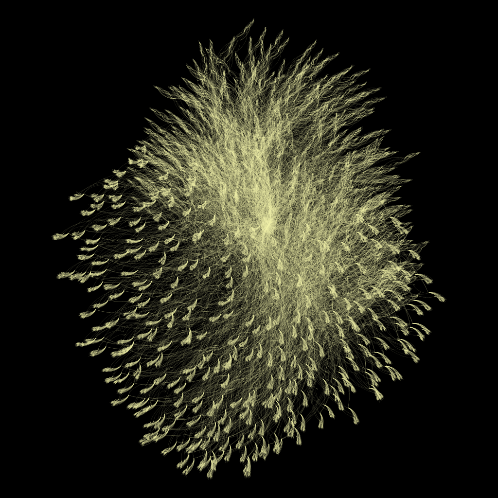

# Create artistic rendering of graph

## Prerequisites

 * AiiDA profile with graph to render
 * [GePhi](https://gephi.org) >= 0.9.1

## Importing the graph

You can import the graph from AiiDA into GePhi either via `.dot` files or by connecting GePhi directly to the AiiDA database.

### Via .dot files

 1. Generate `.dot` files for every graph you would like to include. E.g.

#### AiiDA 0.12.x
```python
from aiida.orm import WorkCalculation
from aiida.orm.data.structure import StructureData
import os

# Query for all structures of interest
qb = QueryBuilder()
qb.append(WorkCalculation, filters={ 'attributes.function_name': {'==': 'collect_outputs'} }, tag='collect')
qb.append(StructureData, project=['*'], edge_filters={'label': 'ref_structure'}, input_of='collect')
results=qb.all()
structures = [ r[0] for r in results]

# Generate graph for all those structures
for s in structures:
    os.system("verdi graph generate {}".format(s.pk))
```

 1. Open GePhi, select File => Open and select all `.dot` files

### Via PostgreSQL database

 1. Open GePhi, select File => import Database => Edge list
 1. Fill databasei connection info with your AiiDA profile connection info
 1. Write appropriate queries as seen below


## Styling the graph

 1. In "Overview" select e.g. Layout => ForceAtlas2
 1. In "Preview" select e.g. "Dark Background"

Enjoy!

## Examples


## Acknowledgements

Thanks go to Jens Bröder for the original idea and Giovanni Pizzi for SQL assistance.
